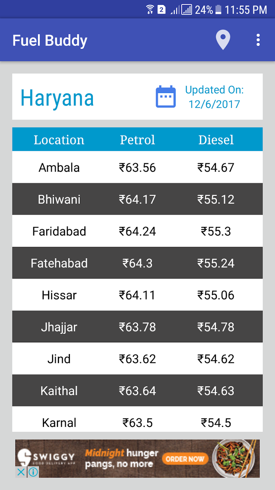
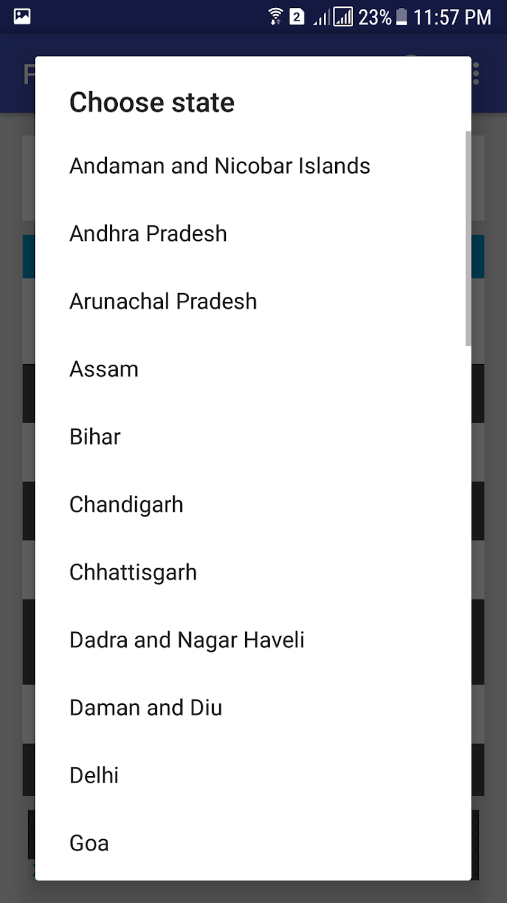
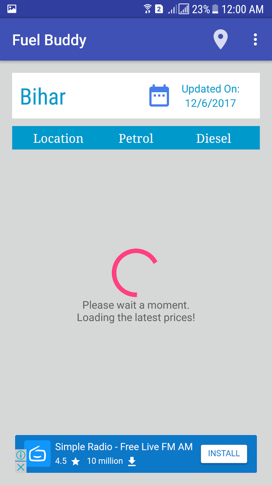

<h1> Fuel Buddy </h1>

A basic Android App to fetch the current petrol/diesel prices in an area.
Currently is slow but I aim to add server side code soon to increase the speed greatly.

Google Play Store : https://play.google.com/store/apps/details?id=com.mayank7319gmail.fuelbuddy&rdid=com.mayank7319gmail.fuelbuddy

<h2> Description </h3>

The daily variations in fuel prices across India has led to inconvenience for several consumers. Fuel Buddy aims to change that.

Fuel Buddy provides access to the latest petrol and diesel prices in each and every major city throughout the various states of India all wrapped in a fluid and simple interface.

Key Features:
* Includes current fuel rate of hundreds of cities pan India.
* Intuitive UI.

Future updates will include price alerts, fuel rate graphs, location based tracking of nearby petrol pumps and many such interesting features.
If you like the app please recommend it to your friends and family.

DISCLAIMER:
The app utilizes freely available sources from the internet and therefore the data may not be completely accurate. The developer is not not responsible for any mishap which may occur due to the use of such data. User discretion is advised.

<h2> Screenshots </h3>

